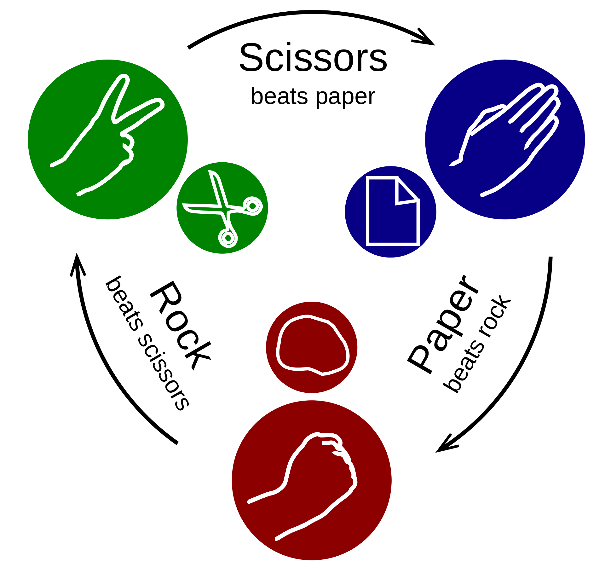

# Paper Rock and Scissors

This a **Python** implementation of a Paper Rock and Scissors game, designed to be played on the console.


## How to install

[**Install Poetry**](https://python-poetry.org/docs/)

and then:

```bash
make install
```

## How to play
To start the game:
```bash
make play
```

The winner of each match is determined by the following schema:
* Paper beats (wraps) rock
* Rock beats (blunts) scissors
* Scissors beats (cuts) paper.

For choosing your action press the **number** corresponding to the action:

* Paper: **0**
* Rock: **1**
* Scissors: **2**

You play against a computer for n matches. n and the human player name is defined before starting the game.

By the end of the n matches, the player that has a bigger number of victories wins the game.
In case the number of victories between the two players is equal the game ends in a tie.


## Requirements

### Production
These are necessary (or recommended) to run the project and play the game:

* [Python 3.10](https://www.python.org/downloads/) - It can be managed by Poetry, no need for manual download
* [Poetry 1.1.13](https://python-poetry.org/docs/) - Poetry is a tool for dependency management and packaging in Python. It allows you to declare the libraries your project depends on, and it will manage (install/update) them for you. It is also capable of managing Python virtual environments outside the box
* [Make 3.81](https://www.gnu.org/software/make/) - For storing project recipes. If you are using a GNU based system you probably don't need to worry about having it. If you are not you can check the [Makefile](Makefile) content and use its commands


### Development
These are only necessary for the development/maintenance of the codebase.
They are all python libs, you can check their version on the [pyproject.toml](pyproject.toml).
I added them because I believe the best way to guarantee code quality is by automating it.
* [pytest](https://pypi.org/project/pytest/) Automated test framework
* [coverage](https://pypi.org/project/coverage/) To measure code coverage by the automated tests
* [black](https://pypi.org/project/black/) Automated code formatter in accord to [PEP 8](https://peps.python.org/pep-0008/). It is used to guarantee code format consistency
* [mypy](https://github.com/python/mypy) Mypy is a static type checker for Python. It is used to enforce coherent type hinting
* [flake8](https://pypi.org/project/flake8/) Style guide checker
* [isort](https://pycqa.github.io/isort/) isort your imports, so you don't have to

### Poetry

Poetry is used in this project for dependency management (it wraps pip) and for managing python version and virtualenv.
Like with pip, if you want to add a new dependency or alter its version you can do it by adding it to either the general dependencies section or the dev-dependencies in the [pyproject.toml file](pyproject.toml).

[pyproject.toml](pyproject.toml) is also a central point for configurations regarding other lib like flake8, black and mypy.

[Check this page](https://python-poetry.org/docs/pyproject/) for all information regarding the pyproject.toml possible and required sections.

## How to develop

After updating the code:

Run the tests to check if you haven't broken anything or lowered the project test coverage (which is breaking bellow 80% now)
```bash
make test
```

If everything is all right with the tests, for linting:
```bash
make restyle
```

and then for validating or catch something that demands manual code modification or deletion:
```bash
make style-check
```

Finally you can validate the type hinting on the program running:
```bash
make static-check
```

All these recipes can be used for automation on a CI pipeline or a pre-commit hook.

